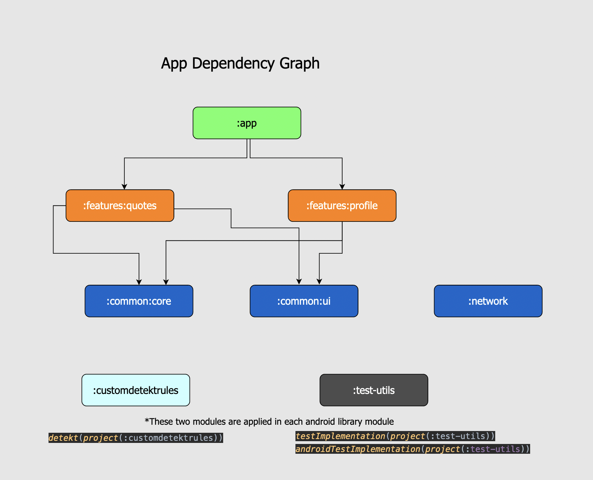

# QuotesApp - MultiPlatform MultiModular Android and Ios APP

This quotes app targets both Android and iOS platforms, and is developed using **Kotlin Multiplatform**, **JetBrains Compose Multiplatform**, **App Modularization**, **Clean Architecture** and **other Jetpack Components and multiplatform libraries**. 
Project is developed in **TDD (Test Driven Development) style** by writing Unit and UI tests.  

This Github project contains 5 main branches:  

   _**main**_ -> Latest version of the project using _**Kotlin MultiPlatform**_ targetting ios and android platforms. UI side of the project is implemented using _**JetBrains Compose Multiplatform**._    
   _**compose_ui_android**_ -> Android version of the project using Jetpack Compose UI  
     _**mvvm**_ -> Initial version written in mvvm pattern    
    _**clean-architecture-layered**_ -> Second refactoring from mvvm to clean architecture (creating UseCases, and separate modules (domain, data, presentation).    
    _**multi_modular**_ -> Third refactoring using modularization (separating domain, data presentation layers as a package inside each feature module)  

**_Related Blog Posts_**  
Achieving iOS Compatibility(KMM+Compose Multiplatform) : https://medium.com/p/edd364854a0d  
Migrating to Jetpack Compose: https://medium.com/p/b7f57504df2b    
Refactoring of architecture of this project: https://medium.com/p/ef6cdcb409a    

## Overview of Architecture

#### Used kotlin multiplatform libraries
_**JetBrains Compose Multiplatform**_ - For providing shared UI for android and ios   
_**Koin**_ - For dependency injection  
_**Napier**_ - Logging library  
**_Navigation_** - https://github.com/chRyNaN/navigation  
_**Kotlinx Datetime**_ - A multiplatform Kotlin library for working with date and time  
_**Ktor**_ - Networking library for both in server and client side   
_**Moko Resources**_ - A multiplatform Kotlin library for sharing resources  

#### Root module
All feature modules are included in shared multiplatform root module. Main responsibility of root module is 
providing dependencies using **_Koin Dependency Injection_**, navigation between modules, and providing MainView for android and ios platforms.  

#### Feature modules
**_:shared:feature:quotes_:**  This module is for listing and adding new quotes.  
**_:shared: feature:profile_:**  This module is for viewing profile.

Each feature module is multiplatform module that is developed using Clean Architecture, and inside 
each module there are 3 packages (_domain, data, presentation_) for separating 
layers. Because in kotlin there is no package visibility modifier, custom **_Clean Architecture_**
**_detekt_** rule is created in **_:customdetektrules_** module, and this module is implemented
in each feature module in order not to breaking clean architecture rules. Beside that each 
feature module includes **_:shared:common:core_** and **_:shared:common:ui_** modules. For testing purposes
**_:shared:test-utils_** is also included in feature modules.   

#### Common Modules
**_:shared:common:core_:**  This module contains core objects that can be used 
in every multiplatform library module, like _Result_ or _ErrorEntity_ classes.

**_:shared:common:ui_:**  This module contains main styling, coloring, theming of the project. 
It also includes some UI helper classes.  

#### Test module
Contains helper classes for making testing easier. It is included in each module 
for both **_Unit_** and **_Instrumentation Tests_**.     

#### CustomDetektRules module
Custom rules for checking code styles using _**detekt**_ are created in this module. 
One custom rule that is created inside module is _Clean Architecture Rule_ which checks that 
if any violation of architecture occurred in somewhere in the code.  
Code style can be checked by running this gradle command: **./gradlew detekt**

#### Kotlin DSL
The project uses the _**Kotlin DSL**_ to make it easy to include new dependencies and versions of libraries and modules.
These are included inside **_buildSrc_** module. Inside buildSrc module 
common multiplatform library gradle script is also created for making gradle files of modules more readable.

## Gradle Scripts
`./gradlew ktlintFormat` - Checks kotlin code styles and format it if possible.    
`./gradlew detekt` - Checks kotlin code styles and custom code styles that is created inside _customDetektRules_ module.     
`./gradlew unitTestReport` - Code coverage report for Unit tests.     
`./gradlew androidTestReport` - Code coverage report for both Android and Unit tests.

*_Each time when adding new commit **pre-commit hook** script will run, which checks if there is any code 
style problem before committing it to Github. This can be skipped using **git commit --no-verify**, 
but it will run again in CI using Github actions._

## App Demo 

You can [download the apk](outputs/quotes.apk), and can add your own quote :).    

https://github.com/mirzemehdi/quotesapp/assets/32781662/510d8c92-f136-4193-bff1-47394470305b  

